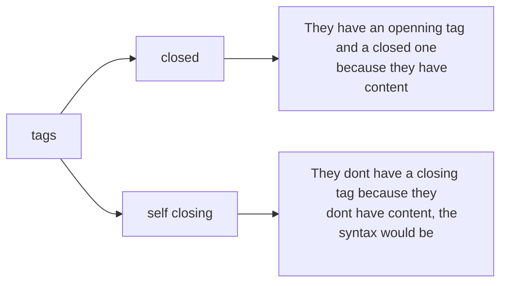

# LESSON 2 BASICS OF HTML

### INTRODUCTION

* Stands for Hypertext Markup Language
* It defines the structure and content of the web page
* Its name is given because 
    
    - Hipertext: html connect the web page with other pages.

    - Markup: Annotate text

### TAGS

They are used to crate the content of the web page. we have 2 types of tags.



The basic structure for the tags is

```html
    <tag> Content </tag>
```

### ATRIBUTES 

These represent extra information for the tags to the browser know how to render these tags

SYNTAX:
```html
    <tagname atributte = "value">  Content </tagname>
```

### STRUCTURE OF  A BASIC HTML BASIC.

```html 
    <!DOCTYPE HTML>
```

It indicates the browser that we need to use the most modern version of html, it means that the browser will render the elements with the most modern html version (html 5)

```html
    <html> 
    
    </html>
```

We have to place all our tags in inside this tags.

```html
    <head>

    </head>
```

This tag contains all the metadata of our web, every thing we place in here will not be shown in the browser,the tags inside this just bring information about the page.

```html
    <body>
        
    </body>
```
This contains all the elements that will be shown in the browser, it means in here we will have all the content of our web page.

