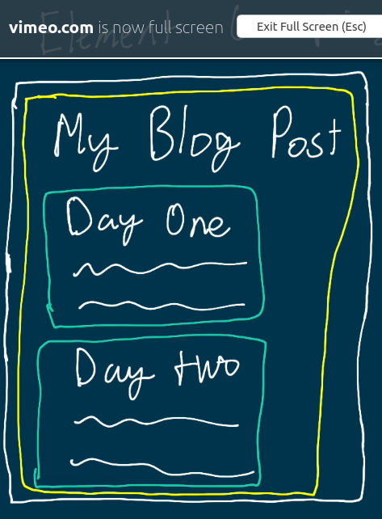
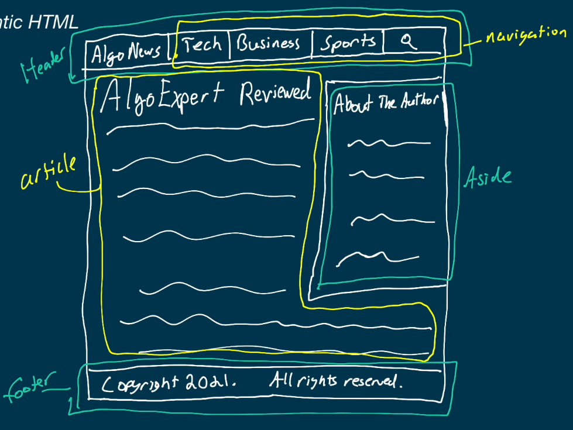

# LESSON 3 SEMANTIC GROUP HTML

During this lesson we discover the fundamental roll of semantic html tags

* They have the usage on avoiding to repeat constantly the same tags to encapsulate elements

For example, let's suppose we want to create the next simple web page.

<center>
    
</center>

Many people use div for all those elements but that is no correct, we should use the corresponding one for each of them


``` html
    <article> </article>
```
This tag is used to place elements that are independent from other elements in the document, it can be news, articles or papers.

``` html
    <section> </section>
```
This is  maybe one the most important tags for html, this helps to group the elements of the web by section, it is a thematic grouping tag.

``` html
    <header> </header>
```

As its own name says this tag is used to render the header of the web page.

``` html
    <main> </main>
```
This tag helps to remark a part of the web page, IT CAN BE USED ONLY ONCE, because is used to remark the most important part or elements of the web page.

``` html
    <nav> </nav>
```
Nav tag contains the links to another web pages, or another parts in the same web page


```html
    <aside> </aside>
```

This tag is used to place elements that are not important or are secondary in the web page, it can contain advertisements, about the author and related stuff.

```html
    <footer> </footer>
```

This tag allows to include a footer in the web page to place messages or copyright

<center>
    
</center>

