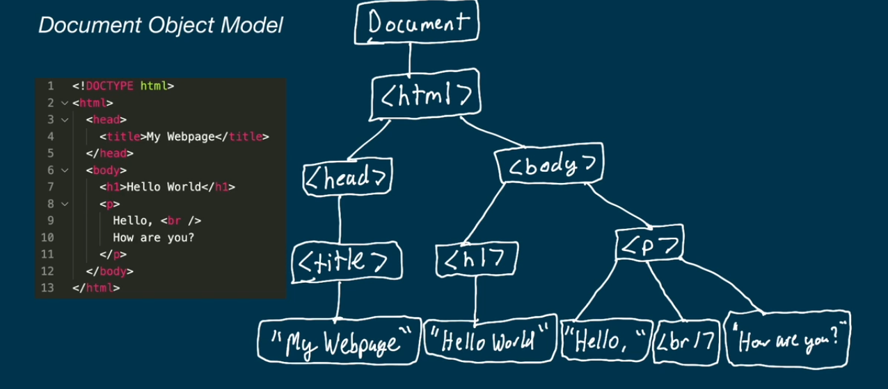

# DOCUMENT OBJECT MODEL

### DEFINITION

It is a representation in memory of the structure and content in a html document that allows programms and scripts to access and manipulate dinamically the content and structure of the web page 


We can define it  as a programming model that represents a web page like a tree where:

1. Each element in html  is represented like a tree node.

2.  The DOM begins with a tree root, that represents all the document 

3. Elements that are inside another element are represented as childs of the container element in the tree representation.

4. It is possible to access the elements of the DOM by using javascript for example making.

```js
    document.getElementById("miID")
```

## VENTAGES

### CHANGING THE CONTENT.

We can modify the content and structure of the web page dinamically, we can change text, attributes and remove or add elements, among many others.

### EVENTS

We can add events like buttons or actions in forms or inputs


###  EXAMPLE OF THE DOM FOR A WEB PAGE.


<center>
    
</center>
