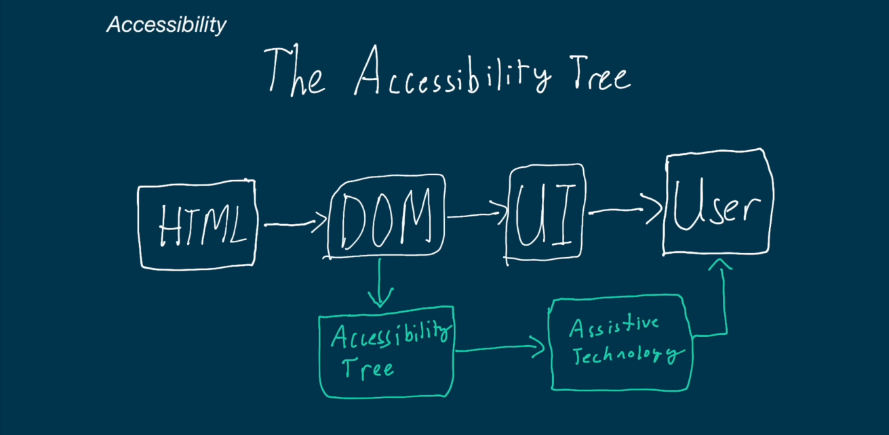

# ACCESSIBILITY  

In this lesson we will see how to make our web site accessible for everyone, to make
this we use semantic HTML and make sure our application works properly with various 
assitive technologies.


### ACESSSIBILITY TREE

This tree is similar to the DOM one but this contains information for accessibility 

Each node in this tree contains 4 elements:

* Names
* Description
* role
* state

### PROCESSS OF ELEMENTS FROM HTML TO USER

<center>
    
</center>
 

As we can see in the image the first process of the elements in html is to pass through the DOM tree after that the elements go through 2 parts; the first one is the User Interface and the second one is Accessibility tree 

The accessibility tree is created  from the DOM tree and kept in sync with it. Assistive technlogies such as screen readers interact with the accessibility tree rather than directly with the DOM.

### WHAT ARE ASSISTIVE TECHNOLOGIES?

## DEFINITION.

Assitive technologies refer to devices, tools, software or equipment designed to help people with disabilities perform tasks that might be much more challenging or impossible for them without assitance.

These technologies aim to enhance the independece, productivity and overall quality of life for individuals with disabilities.

Assitive Techonologies adress  a wide range of disabilities including those related to mobility, hearing, cognition, and communication.

One crucial aspect of web accesibility and assitive technologies is the Accessibility Tree wich is a representation of the structure and properties of a web page.

### MAIN USAGE

This tree is really important to allow accessibility and experience of users with some disabilities 

This tree is the representation of the structure of a web page that centers in the information and characteristics that are important for any kind of user 


### HOW TO GET A WEB PAGE FOR ALL USERS

* Use descriptive content, labels and alt atributes
* Use semantic group elements (this helps a lot the tree )
* Test keyboard controlls: Add some shorcuts with the keyboard to navigate easier
  

### WHY ACCESSIBILITY TREE IS IMPORTANT FOR ASSISTIVE TECHNOLOGIES.

1. **SCREEN READERS ACCESIBILITY**. Screen readers, which are commonly used by individuals with impairments, rely on the Accessibility Tree to navigate and interpret web content. The tree ensures that information is presented in a meaninful and organized way.

2. **SEMANTIC INFORMATION**. This Tree includes semantic information about elements on a web page, such as headings,links, form controls.This semantic information is crucial for assistive technologies to convey the structure and purpose of the content to users.

3. **KEYBOARD NAVIGATION**. Some individuals with mobility impairments rely on keyboard navigation to browse websites. The accessibility Tree helps ensure that all interactive elements are reachable and operable using keyboard, promoting an inclusive user experience.

4. **ALTERNATIVE TEXT FOR IMAGES**.
The accesibility tree includes information about images, including alternative text.This is vital for individuals who use screen readers to understand  the content of images in a web page.


## SUMMARY
The Accessibility tree plays a crucial rol in making web content accessible to individuals with dissabilities. It acts like  a bridge between the content  and assistive technologies, enabling  a more inclusive digital experience.


### WAI-ARIA 

The "Web Accessibility Initiative - Accessible Rich Internet Applications" specification  for accessible HTML created by the World Wide Web Consortium (W3C). Oftentimes just referred to as just ARIA, it contains  a set of HTML  attributes that can be added to provide extra information to the accessibility tree


### ARIA ATRIBUTES

They are usually grouped into three main categories:

* **Roles**.- What the element is doing,  used to define the purpose of the element. These can be broken in more subgroups
  1. **Landmark:** Major content areas, navigational landmarks.
  2. **Structure**: Document structure information.
  3. **Widget**: Interactive Elements.
  4. **Window**: sub-windows in the browser
  5. **Live Region**: Regions with dynamically changing content.
* **Properties**: Extra meaning and characteristcs of the element, such as labels.
* **States**: current state of the element, such as if it disabled or not.


### LANDMARK ROLES (Reference point)


En HTML, una "landmark" (punto de referencia) es una región específica de una página web que se utiliza para identificar y proporcionar una navegación más fácil y accesible para los usuarios. Las landmarks son elementos HTML con roles específicos que ayudan a los usuarios, especialmente aquellos que utilizan tecnologías de asistencia, a comprender y navegar la estructura de la página web de manera más eficiente.

Some elements that can act like a landmark are:

1. header
2. nav
3. main
4. aside
5. footer
6. section
7. article
8. form

We can also crete a landmark by adding the attribute role

An element of HTML with the a specific  attribute "role" that provides extra semantic information about the element ( this elements are grouping elements and represent an entire section of the web page).

<header role="banner">
    <h1>Logotipo de la Empresa</h1>
    <nav role="navigation">
        <ul>
            <li><a href="/">Inicio</a></li>
            <li><a href="/productos">Productos</a></li>
            <li><a href="/contacto">Contacto</a></li>
        </ul>
    </nav>
</header>

```html
<header role="banner">
    <h1>Logotipo de la Empresa</h1>
    <nav role="navigation">
        <ul>
            <li><a href="/">Inicio</a></li>
            <li><a href="/productos">Productos</a></li>
            <li><a href="/contacto">Contacto</a></li>
        </ul>
    </nav>
</header>
```
<footer role="contentinfo">
    <p>&copy; 2023 Mi Empresa. Todos los derechos reservados.</p>
    <p><a href="/privacidad">Política de Privacidad</a></p>
</footer>

```html
<footer role="contentinfo">
    <p>&copy; 2023 Mi Empresa. Todos los derechos reservados.</p>
    <p><a href="/privacidad">Política de Privacidad</a></p>
</footer>
```

```html
<div rol ="banner">
        <h1> My accessible Web Page </h1>
</div>
```

this are the first elements that are going to be seen by the user in the web page.

### STRUCTURE ROLES

Document structural information 

This are really similar to the last one but with smaller elements such as lists , table etc, in the same way the use the attribute role to give the usage.


### WIDGET ROLES.

These roles are for interactive elements such as tab,searchbox, button 

<div role="button">
    Click Me
</div>

### WINDOW ROLES 

They are subwindows in the browser
Examples:

- dialog
- alertdialog

<div role ="dialog" aria-labelledby = "title">
    <h2 id="title"> Succesfully saved changes </h2>
    <button> Dissmis </button>
</div>


### LIVE REGION ROLES

This elements will be checked periodically by the assitant technology of the web page to inform the user of any changes on the content, this areas contain information  that is relevant for the user and that change without need  that the user make specific actions


###  ARIA LIVE (YEAH ITS SPELLING IS CORRECT).

It describes live content and the importance of the element

```html
    <div aria-live="polite">
        My content will change
    </div>
```
some attributes of aria live
- **off**: Do not announce changes.
- **polite**: Announce changes not really common and when the page is innactive.
- **assertive**: Announce changes as soon as possible


### Aria Properties.

1. **aria-label**: Is used to provide a consice label that describes the purpose of an element to assistive techonologies, this label is not visible in the screen but provides relevant information for assitive technologies.

```html
<button aria-label="Close">X</button>
```
In that example we are saying to the assitive technologies that that the propose of the button is to Close something.

2. **aria-labelledby**: It is used to associate an element with one or more elements that serves as labels for the current element.

```html
<h2 id="section-title">Section 1</h2>
<div aria-labelledby="section-title">
  <!-- Content of Section 1 -->
</div>
```

In this example the div is associated with the heading "Section 1" using aria-labelledby.

With this, Screen reader, will understand that the content of the div is related to "Section 1".

3. **aria-describedby**: It is used to associate an element with aditional descriptive text,which provides more information about the element's purpose or function.

```html
<input type="text" aria-describedby="username-description">
<div id="username-description">Please enter your username.</div>
```
In this example, the 'aria-describedby' attribute associates the 'input' element with the 'div' containing the text "Please enter your username". This information helps associative technologies understand the expected input.


### ARIA STATES.

Refer to properties that describe the dynamic characteristics of user interface elements. This states help convey information about the current state or condition of an interactive component to assitive technologies.

1. **aria-disabled**: Indicated whether an element is currently disabled or not. It is particularly useful for conveying the disabled state of interactive elements like buttons or form control.

```html
<button aria-disabled="true">Submit</button>
```

2. **aria-expanded**: Indicates whether a widget that can be expanded or collapsed is currently expanded or not

```html
<div aria-expanded="false">
  <!-- Collapsed content -->
</div>
```
3. **aria-checked**: Idicates the current "checked" state of checkbox or radio button.

```html
<input type="checkbox" aria-checked="true"> Checked
```

4. **aria-selected**: Indicates whether an item on a list or a set of items is currently selected. It is currently used in navigation menus or tabbed interfaces.

```html
<li aria-selected="true">Item 1</li>
```

5. **aria-hidden**:It indicates whether an element is currently visible or hidden 

```html
<div aria-hidden="true">This content is visually hidden.</div>
```

6. **aria-pressed**: Toggle currently pressed

## IMPORTANT NOTES:

1.  Assistive Technologies dont iteract with the DOM Tree but with the Accessibility Tree.


2. As you can see in the image, after the the DOM the content of our web page goes to the User Interface or to the accessibility tree, once it is the accesibility tree it goes to the assistance techonlogies and finally to the user.

<center>
    
</center>

3. **LANDMARK ROLES**. A landmark means just a representative, area, it means if the element is a footer, a navigation area or similar.


### OTHER CONCERNS.

* Browser compability.
* CSS Accesibility
    1. Use contraste
    2. Legible Fonts.
    3. Mobile Support.

* Internationalization
    1. Language Support.
    2. Test with different "style" languages.
    